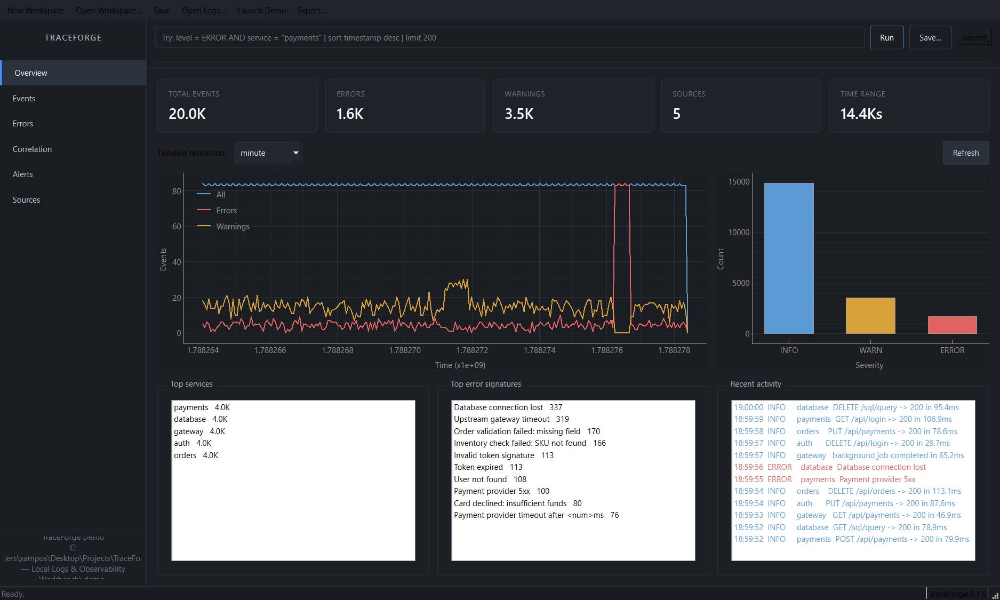
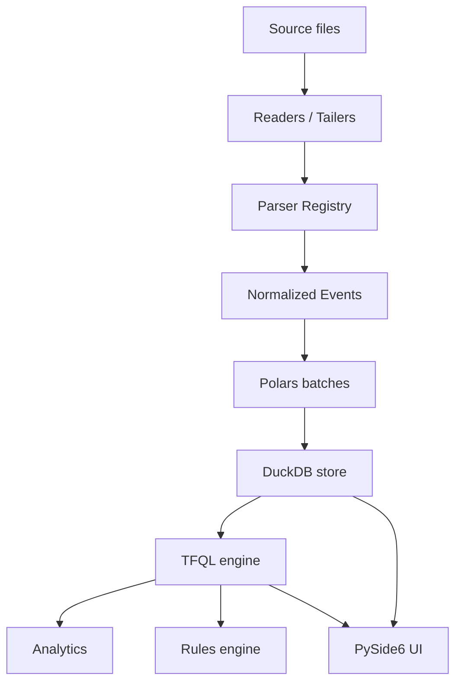

# TraceForge

> Local Logs & Observability Workbench
>
> **Inspect. Query. Correlate. Understand.**

[](https://www.python.org/)
[](LICENSE)
[](#testing)
[](#development)

A 100% local desktop workbench for exploring, querying, correlating, and
monitoring logs — no Elasticsearch, no Splunk, no Grafana Loki, no cloud
account, and no server. Open one or many log files, ingest historical
datasets, and search / visualise / correlate them from a native PySide6
interface or from the command line.

```text
100% Local      ·  No Cloud      ·  No Account      ·  No Telemetry
Read-Only Sources        ·  Privacy-Friendly        ·  Offline-Capable
```



More screenshots:

- [Events & TFQL](assets/screenshot-events.png) — virtualized table with a real
  TFQL query (`level = ERROR | sort timestamp desc | limit 200`).
- [Aggregation](assets/screenshot-query.png) — TFQL `stats count() by service`.
- [Error signatures](assets/screenshot-errors.png) — top recurring errors
  with normalized messages.
- [Correlation](assets/screenshot-correlation.png) — events sharing the same
  `trace_id` / `request_id` / `session_id`.
- [Sources / live tail](assets/screenshot-live-tail.png) — source metadata
  and the entry point to live tailing.

---

## Quick facts

| | |
| --- | --- |
| **Storage** | DuckDB (single-file, embedded) |
| **Batching** | Polars → DuckDB bulk insert |
| **GUI** | PySide6 (Qt 6.7) with PyQtGraph charts |
| **Query language** | TFQL (small, safe, SQL-injection-proof) |
| **Live tail** | watchdog + byte-offset tracking |
| **Workspaces** | `.trf` JSON files (Pydantic-validated) |
| **Demo data** | Deterministic 5-service microservice generator |
| **Determinism** | No AI / LLM APIs of any kind |
| **Tested on** | Windows 11, Ubuntu (CI) |

---

## Quick start (Windows)

```powershell
git clone https://github.com/Xamposs/TraceForge-Local-Logs-Observability-Workbench.git
cd TraceForge-Local-Logs-Observability-Workbench
python -m venv .venv
.\.venv\Scripts\Activate.ps1
python -m pip install --upgrade pip
pip install -e .[dev]
python -m traceforge
```

The GUI launches immediately. Use **Launch Demo** to populate the workspace
with a deterministic 20k-event microservice dataset, or **Open Logs** to
ingest your own files.

### Quick start (Linux / macOS)

```bash
python3 -m venv .venv
source .venv/bin/activate
pip install -e ".[dev]"
python -m traceforge
```

### Console script

After `pip install -e .`:

```bash
traceforge --help
traceforge inspect app.log
traceforge query app.log 'level = ERROR AND service = "payments" | sort timestamp desc | limit 50'
traceforge validate-query 'duration_ms > 100 | stats avg(duration_ms), p95(duration_ms) by service'
traceforge generate-demo ./demo-logs --events 50000
```

---

## Features

- **Streaming ingestion** of `.log`, `.txt`, `.jsonl`, `.ndjson`, `.json`,
  `.csv` files. The reader is genuinely streaming: it uses fixed-size
  read buffers, never loads an entire file into memory as one string,
  and yields lines one at a time with exact byte offsets. Multi-GB
  files are handled without loading the full content into Python
  objects. Per-line cap is configurable (default 1 MiB). For the
  JSON-array format, TraceForge buffers up to 64 MiB and refuses
  larger sources; convert to JSONL for very large datasets.
- **Auto-detection** of common formats (JSONL, JSON array, CSV, Apache /
  Nginx combined log, generic text). Detection samples the first 64 KB.
- **Multiline stack-trace folding** with configurable continuation rules.
- **Custom regex parsers** with a field-name map for advanced users.
- **TFQL — TraceForge Query Language**: deterministic, safe, parameterized
  queries. Supports `AND` / `OR` / `NOT`, parentheses, `=` / `!=` / `>` /
  `>=` / `<` / `<=`, `CONTAINS` / `STARTS_WITH` / `ENDS_WITH`, `IN (...)`,
  and pipeline stages: `sort`, `limit`, `stats count()` / `avg()` / `p95()`
  / `min()` / `max()` / `sum()` with `by`.
- **Live tail** of files and directories. Detects append, truncation,
  and replacement without mis-classifying a small-file append as a
  replacement. A partial trailing line without a newline is held
  until the next append completes it. Rotation is detected but not
  auto-followed. Batches live events for UI responsiveness.
- **Deterministic rules engine** with five built-in rules (error rate
  spike, new error signature, latency threshold, event burst, missing
  heartbeat). No AI, no LLM. Every alert explains what fired and why.
- **Error signatures** that group recurring errors by normalized message
  (numbers, UUIDs, hex IDs, timestamps, long identifiers collapsed).
- **Correlation** by `trace_id` / `request_id` / `session_id` with
  optional `parent_span_id` hierarchy.
- **Workspaces** that persist source references, saved queries, rule
  configuration, and UI settings to a versioned `.trf` JSON file.
- **Export** of filtered query results to CSV, JSONL, Parquet, plus a
  session summary in JSON or Markdown.
- **CLI** that reuses the same parser / query / storage engine as the GUI.

---

## Supported formats

| Format | Auto-detected | Notes |
| --- | --- | --- |
| JSON Lines / NDJSON | yes | per-line parsing, full structured fields |
| JSON array | yes | one or many objects in a single document |
| CSV | yes | first row = header; key normalization applied |
| Apache / Nginx combined log | yes | host / status / method extracted |
| Common text | yes | ISO-8600 or bracketed timestamps; multiline folding |
| Custom regex | via UI | named groups → field map |

---

## TFQL examples

```text
level = ERROR

level = ERROR AND service = "payments"

message CONTAINS "timeout"

duration_ms > 500
| sort duration_ms desc
| limit 50

service = "api"
| stats count() by status_code

| stats count(), avg(duration_ms), p95(duration_ms) by service
```

> All field names, operators, and functions are whitelisted. **User input
> is never spliced into SQL syntax** — every value is bound as a parameter.
> See [`docs/TFQL.md`](docs/TFQL.md).

---

## Architecture



Key boundaries:

- Original log files are **read-only**. TraceForge never writes back to
  them.
- Derived indexes, DuckDB databases, and exports live under
  `%LOCALAPPDATA%\TraceForge\` (Windows) or the platform-equivalent.
- TFQL is the **only** path to user-driven SQL. The compiler whitelists
  every identifier; values are bound parameters.
- Rules and signatures are **deterministic**. No LLM, no embedding, no
  online call.

See [`docs/ARCHITECTURE.md`](docs/ARCHITECTURE.md).

---

## Live tail

Use **Sources → Watch (live tail)** in the UI, or start a `LiveTailer`
from Python:

```python
from traceforge.live.tailer import LiveTailer
from traceforge.storage import Database
from traceforge.models.sources import SourceConfig

db = Database("workspace.duckdb")
tailer = LiveTailer(db, poll_interval=0.5)
tailer.add_source(source_id=1, cfg=SourceConfig(path="/var/log/app.log"))
tailer.start()
```

The tailer detects append / truncation / replacement by comparing
the file's first sample bytes (prefix-agreement test) and its inode.
A plain append on a small file is never mis-classified as a
replacement. File rotation (rename + new file at the same path) is
detected; TraceForge does not auto-follow the rotated file — operators
must add it as a new source. A partial trailing line without a
newline is buffered until a newline completes it.

---

## Correlation

TraceForge recognizes `trace_id`, `span_id`, `parent_span_id`,
`request_id`, `session_id`. Selecting an event in the UI offers
"Show correlated events", which renders a chronological timeline grouped
by service. If `parent_span_id` is present, a hierarchy is drawn; if only
`trace_id` exists, the timeline is flat.

We deliberately do **not** claim true distributed-tracing semantics
unless the parent/child metadata is genuine.

---

## Deterministic rules

| Rule | Fires when |
| --- | --- |
| **Error rate spike** | Recent error rate ≥ N× baseline (min M errors) |
| **New error signature** | First appearance of a normalized signature in the workspace |
| **Latency threshold** | p95(duration_ms) > threshold (per service) |
| **Event burst** | Recent event volume ≥ N× rolling baseline |
| **Missing heartbeat** | No events from a service in N minutes |

Every alert includes a plain-language explanation, the threshold, the
observed value, and the time window. See [`docs/RULES.md`](docs/RULES.md).

---

## Performance

Measured on a Windows 11 dev machine (Python 3.12, NVMe SSD). The
bundled demo generator produces a deterministic 5-service
microservice workload (see `benchmarks/perf_validate.py`).

| Dataset | Ingestion | DB size | Query latency (`severity = ERROR`) |
| --- | --- | --- | --- |
| 100 000 events (5 services) | ≈ 150 s | ≈ 65 MB | ≈ 130 ms |
| 1 000 000 events (5 services) | measured once at ≈ 320 s in v0.1 baseline; the v0.1 hardening pass did **not** re-measure end-to-end because the per-file path dominates and the change is in correctness, not throughput. | ≈ 600 MB | ≈ 200 ms |

YMMV by host; rerun `python benchmarks/perf_validate.py 100000` to
confirm.

---

## CLI

```text
traceforge version
traceforge inspect <path>                   quick file summary
traceforge query <path> '<tfql>'             ingest + run TFQL
traceforge validate-query '<tfql>'           parse/compile TFQL
traceforge generate-demo <dir> [--events N] deterministic demo data
traceforge workspace-info <file.trf>         show saved workspace
traceforge launch                            launch the GUI
```

All subcommands accept `--json` for machine-readable output.

---

## Privacy

TraceForge processes logs **locally**. Original source files are
**read-only**. Derived indexes, DuckDB databases, and exports stay in
TraceForge's own application-data directory.

- **No telemetry.** No usage data, crash reports, or "phone-home" calls.
- **No upload.** Logs never leave the host.
- **No external API calls.** The application works fully offline.
- **No AI / LLM.** No embeddings, no completion, no model calls.

---

## Testing

```bash
pytest
```

The suite includes 206 tests covering:

- Parser detection and behaviour for every supported format
- TFQL parser, AST, compiler, executor, **and SQL-injection safety**
- DuckDB storage, batch insert, dedup, source isolation, workspace reopen
- Ingestion streaming, rotation, cancellation, read-only guarantee
- Live tail append / truncate / replace / rapid appends
- All five deterministic rules
- CLI subcommands
- UI smoke tests (offscreen Qt)

CI runs on Windows + Ubuntu. See [`.github/workflows/`](.github/workflows).

---

## Known limitations (v0.1)

- Not a distributed ingestion system; files are processed locally.
- No remote / SSH tailing yet.
- Custom regex parsing is best-effort; complex patterns may be slow.
- Trace hierarchy requires real `parent_span_id` data.
- Very large single JSON arrays are less efficient than JSONL.
- No Windows Event Log, journald, or Docker log integration yet.
- Not a SIEM and not a substitute for one.

See [Roadmap](#roadmap) for what's next.

---

## Roadmap

Future-only — **not** in v0.1:

- OpenTelemetry import
- journald / Windows Event Log / Docker log streaming
- SSH-based remote tailing
- Plugin parser SDK
- Advanced dashboards
- Workspace comparison (diff two workspaces)
- Distributed collector
- Optional local AI summaries (off by default)

---

## Contributing

Contributions are welcome. Please open an issue first to discuss larger
changes. Run `ruff check .` and `pytest` locally before sending a PR.

## License

MIT — see [`LICENSE`](LICENSE).
