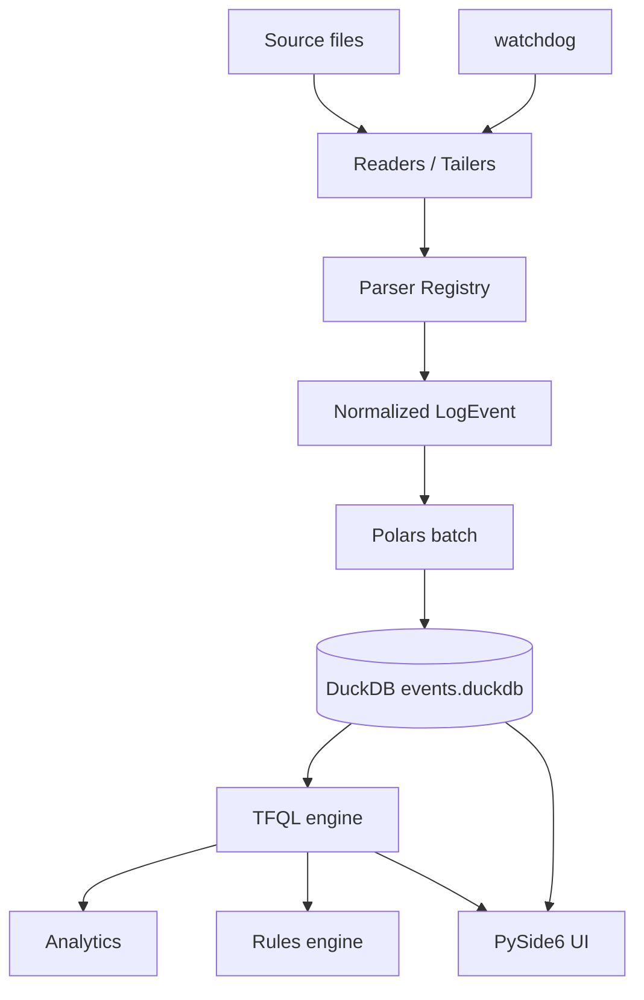

# Architecture

TraceForge is a local-first desktop observability workbench. The code is
organised as a layered pipeline with explicit boundaries.



## Layer responsibilities

### 1. Readers / Tailers (`traceforge.ingestion.reader`, `traceforge.live.tailer`)

- Stream large files in 1 MiB chunks, never reading an entire multi-GB
  file as a single buffer.
- Per-line byte cap (default 1 MB) to avoid OOM on pathological inputs.
- Approximate line-number tracking (good enough for informational
  purposes — line_number is not the primary key).
- `iter_lines(path, start_offset=...)` for incremental reads.
- `LiveTailer` watches files / directories via `watchdog`, tracks byte
  offsets, and detects append / truncation / replacement.

### 2. Parser Registry (`traceforge.parsers`)

- Built-in parsers: `JsonLinesParser`, `JsonArrayParser`, `CsvLogParser`,
  `ApacheAccessParser`, `NginxAccessParser`, `CommonTextParser`,
  `GenericRegexParser`.
- Detection samples the first 64 KB and scores parsers by overlap with
  their respective patterns.
- Path hint (file extension) nudges the order in which parsers are
  tried.
- A `MultilineAssembler` folds stack-trace continuations onto the
  preceding primary line.

### 3. Normalized events (`traceforge.models.events.LogEvent`)

A canonical Pydantic model with the fixed fields enumerated in the
project brief. Unknown keys from JSON input are preserved under
`attributes: dict[str, Any]`.

Event identity is **deterministic** (no Date.now() randomness):

```text
event_id = sha1( path | line_number | byte_offset | content_hash )[:24]
```

A re-ingest of the same line produces the same `event_id`, so live-tail
reprocessing does not create duplicates.

### 4. Polars batching (`traceforge.ingestion.pipeline`)

- Bounded-memory line buffer.
- For line-streaming parsers (JSONL, text, apache, nginx, custom regex)
  we feed one line at a time and flush a `Polars` DataFrame every
  `batch_size` events.
- For document parsers (CSV, JSON array) we send the whole file once
  per source.
- Bulk insert uses DuckDB's `INSERT OR IGNORE ... BY NAME` with a
  registered Polars DataFrame — this is ~10× faster than per-row
  parameter binding on Windows.

### 5. DuckDB store (`traceforge.storage`)

- One `.duckdb` file per workspace, kept under
  `%LOCALAPPDATA%\TraceForge\workspaces\ws-…\`.
- Two tables: `events` and `sources`. Indexes on `timestamp`, `severity`,
  `source_id`, `service`, `trace_id`, `request_id`, `session_id`.
- Parameterised queries everywhere. `event_id` is the primary key, so
  re-inserts are silently deduped.

### 6. TFQL engine (`traceforge.query`)

- Hand-written recursive-descent parser.
- AST dataclasses for expressions, sorts, limits, stats.
- Compiler whitelists every identifier and binds every value as a
  parameter.
- Executor runs the compiled SQL against the workspace's DuckDB.
- Clear, position-aware error messages with suggestions.

### 7. Analytics (`traceforge.analytics`)

- `timeline` — time-bucketed event counts (errors, warnings).
- `severity_distribution` and `top_services` / `top_error_signatures`.
- `normalize_signature` — deterministic error message normalization.
- `collect_correlation` / `build_hierarchy` — event correlation.

### 8. Rules engine (`traceforge.rules`)

- Plug-in registry of pure-Python rules. Each rule receives a
  `RuleContext` and returns a list of `Alert`s.
- Built-in rules: `error_rate_spike`, `new_error_signature`,
  `latency_threshold`, `event_burst`, `missing_heartbeat`.
- Every alert includes a plain-language explanation, threshold,
  observed value, and time window.

### 9. Live tailer (`traceforge.live`)

- Per-source byte offset persisted in the in-memory state, used to
  detect truncation / replacement.
- `on_events` callbacks deliver new events to the UI in batches.
- Polls the file system for size changes (default 0.5 s) and reacts to
  watchdog events for faster updates.

### 10. UI (`traceforge.ui`)

- `Session` — the central data object (Qt-free). Subscribers are
  notified via a `subscribe(fn)` callback registry.
- `MainWindow` (PySide6) hosts:
  - `WelcomePage` (empty state)
  - `OverviewPage` (metric cards, timeline, top services / signatures)
  - `EventsPage` (virtualized `QTableView` + details)
  - `ErrorsPage` (top error signatures + samples)
  - `CorrelationPage` (trace / request / session timelines)
  - `AlertsPage` (rule evaluation results)
  - `SourcesPage` (source metadata)
- Long-running work (ingestion, queries) runs in `QThreadPool` workers.

## Boundaries and invariants

- **No write to source files.** Every `ingest_file` reads only; the
  source's SHA-256 is checked before and after.
- **No network I/O.** No telemetry, no uploads, no AI/LLM calls.
- **No arbitrary SQL.** TFQL is the only path to user-driven SQL.
  Identifiers are whitelisted, values are parameters.
- **No eval / exec.** No part of the application ever evaluates
  arbitrary code from log content or query input.
- **ANSI / HTML escaping.** Display text is escaped; the UI does not
  render raw HTML from log content.

## File-system layout

```text
%LOCALAPPDATA%\TraceForge\
├── workspaces\
│   └── ws-<timestamp>-<hash>\
│       ├── events.duckdb          # local analytical store
│       ├── events.duckdb.wal      # DuckDB write-ahead log
│       └── workspace.trf          # Pydantic workspace JSON
├── cache\                         # reserved for future use
├── config\                        # reserved for future use
└── tmp\                           # scratch space
```

The workspace `.trf` file is small and portable. Move it (with its
`events.duckdb`) to another host and the workspace reloads cleanly.
